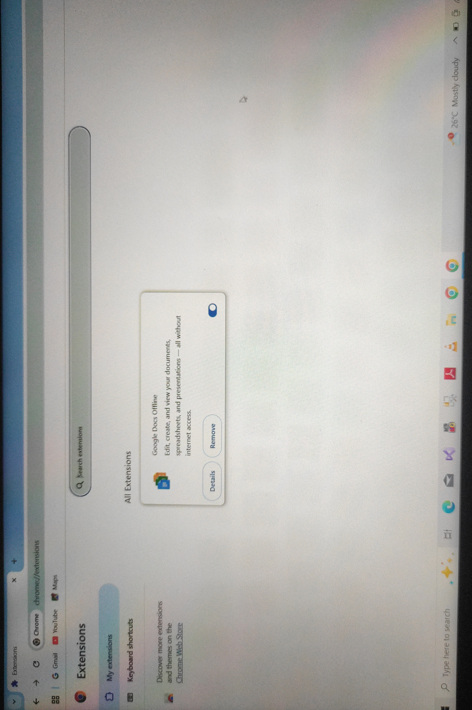

Task 7 - Browser Extensions

 •Description
In this task, I explored **browser extensions**.  
A browser extension is a small software program that customizes the browsing experience.  
Extensions can add new features, block ads, manage passwords, and much more.

•Steps I Followed
1. Opened the Chrome browser.  
2. Navigated to the **Extensions** section.  
3. Checked installed extensions (Google Docs Offline in my case).  
4. Took a screenshot of the extensions page.  

•Screenshot
Here is the screenshot proof of my browser extension:  

•Outcome
- I understood how to access and manage browser extensions.  
- Learned how extensions improve productivity and browsing experience.  
